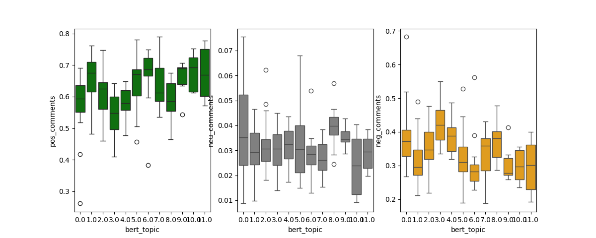

## Decoding YouTube Comments: Extracting Insights Through Topic Modeling and Sentiment Analysis

### Abstract

This project delves into the intricate world of online discourse by employing Natural Language Processing (NLP) techniques to analyze YouTube comments. The study combines the power of topic modeling and sentiment analysis to unravel patterns, trends, and sentiments embedded within YouTube data to uncover potential methods of dissecting comprehensive insights using comments. Our methodology involves preprocessing text, extracting topics, and sentiment analysis.

The topic modeling phase employs advanced algorithms to categorize videos into coherent themes. Simultaneously, sentiment analysis dissects the emotional tone of comments, ranging from positive to negative, enabling a nuanced understanding of user sentiments.

Results reveal that there sentiments tend to be the same between all YouTube videos in a channel, with there being the same proportions of positive, neutral, and negative comments in every video. When applying topic modeling on a channel to categorize its videos, we observe little differences in sentiments between topics when latent dirichlet allocation (LDA) was used, but somewhat noticeable differences when BERTopic was used.

### Introduction

YouTube is an extremely popular online video sharing and social media platform, and stands out as a prolific source of user-generated content. The vast repository of YouTube comments accompanying videos represents an untouched tapestry of user data. Unraveling the patterns within them presents new possibilities of undiscovered insights that may help content creators engage with their YouTube channels.

Much of the code in this project is written with a goal of automation in mind. That is, it should be possible to get results with minimal interaction from the user. Another aim is to create a method for automatically computing meaningful results so that all content creators on the platform can receive their own insights for their channel.

### Methodology/Dataset

Data collection is performed by using YouTube API or web scraping techniques. 

Each video's comment sentiment is determined by the proportion of positive, neutral, and negative comments, classified by a [multilingual transformer](https://huggingface.co/lxyuan/distilbert-base-multilingual-cased-sentiments-student), chosen to account for YouTube channels that normally receive comments in multiple languages.

The descriptions or video transcripts are also used as text for topic modeling. In particular, we have used the latent dirichlet allocation (LDA) and BERTopic topic modeling techniques. The resulting models are then used to calculate the probability of each comment to match the topic assigned to the video as a way to guage viewer engagement to the content.

### Results

Sentiments are typically the same in all YouTube videos in a channel, that is, there are similar proportions of positive, neutral, and negative comments in every video.

In topic modeling, when LDA is used, the resulting topics end up with a lot of words that are not stopwords, but are still common across all descriptions/transcripts and do not pertain to any particular topic. For example, we may see social media links when using video descriptions, or filler words such as "um" or "like" when using transcripts. BERTopic with some customizations (e.g., KeyBERTInspired) does a better job at reducing the use of these common words.

Furthermore, we observe little to no differences in sentiments between topics when LDA was used, but somewhat noticeable differences when BERTopic was used. 

### Discussion

This project has not yielded enough data to make solid, general conclusions about all YouTube channels. All the chosen channels are discussion-heavy, which especially affects the usefulness of transcripts. Furthermore, larger older channels were cut due to time and monetary constraints. The hope is that this should make a good starting point for future endeavors.

Using sentiment analysis to guage how "positive" or "negative" user feedback does not seem particularly helpful since it gives too similar results for every video in a channel. It is common for many viewers of an established channel to be "subscribers," or viewers who opted to be notified of new videos released by the channel. If the comments are written by the same set of people, the subscribers, it might follow that the sentiments would also be similar for each video. Thus, it would seem that this specific use of sentiment analysis could be more useful in the context of changing over time, where changes in subscribers, be it in numbers or their demographics, may reflect changes in the comments and their sentiments. 

We observe more immediate results when analyzing sentiments by topic. Results from LDA had little to show, but BERTopic was able to create some differences in sentiments. It may be because some topics naturally elicit more positive or more negative sentiments. Although this might make the sentiments predictable, it may still help content creators form a sense of how engaged viewers are to their content, or how their viewers have reacted. In certain contexts, it may also be helpful to understand why the viewers did not react with the expected sentiments to help bridge the disconnect between creator and viewer.

In performing topic modeling with BERTopic on the data from the YouTube channel Andrew Huberman, there was a significant improvement in the results when the number of topics was forced (n=12). In practice, if this process were to be automated, we would need to allow content creators to be able to play with the number of topics. If done correctly, this could be an effective way to encourage content creators to engage with their viewers more closely.

### Conclusion

This project has explored a few possibilities for using YouTube comments to create unique insights to help content creators engage with their audience. Sentiment analysis on the comments can be used to get an overall feel of the viewer's sentiments, and in combination with topic modeling on video descriptions or transcripts, it can offer a brand new perspective on the data. As we continue to delve deeper, further research can build upon our findings, refining methodologies, and exploring new dimensions of user-generated content analysis.
